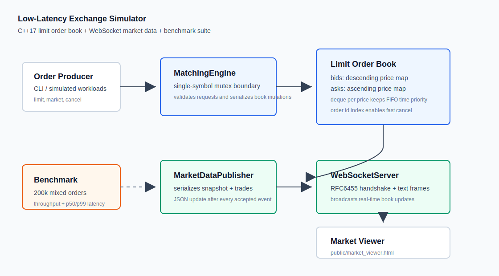
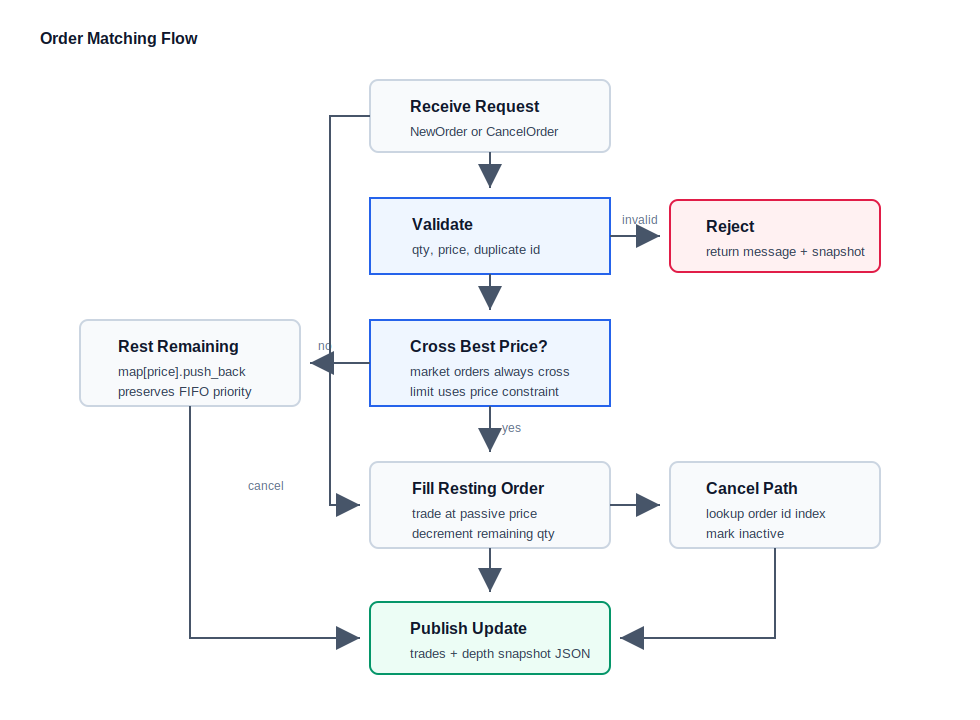

# Low-Latency Exchange Simulator

一个用 C++17 实现的低延迟交易所撮合模拟器，包含限价订单簿、价格-时间优先撮合、撤单、WebSocket 实时行情推送、浏览器盘口监控页和可复现压测。

这个项目的重点不是“写一个玩具订单簿”，而是把交易系统里几个面试官会追问的点都落到代码里：撮合路径如何保持确定性、同价位如何保证 FIFO、撤单如何快速定位、行情如何在每次状态变化后推送，以及吞吐和延迟如何量化。

## 项目亮点

- 使用 C++17 实现 limit-order-book matching engine，支持 market order、limit order 和 cancellation。
- 买盘使用降序 price map，卖盘使用升序 price map；同价位订单用 deque 保留到达顺序，实现 price-time priority。
- 使用 order id 索引定位挂单，撤单通过 inactive 标记和撮合路径惰性清理减少队列中间删除成本。
- 内置无第三方依赖 WebSocket 服务，完成 RFC6455 握手、SHA-1、Base64 和 text frame 广播。
- 每次订单事件后推送 JSON 行情更新，包含 trades 和 order book depth snapshot。
- 提供 benchmark 工具，在模拟交易负载下验证 50,000+ orders/sec 的吞吐目标。
- 提供浏览器盘口监控页面 `public/market_viewer.html`，可以实时查看 bids、asks 和成交流。

## 系统架构



## 撮合流程



## 目录结构

```text
.
├── apps/
│   ├── benchmark.cpp          # 模拟交易负载压测
│   └── exchange_server.cpp    # WebSocket 行情服务 + CLI 订单入口
├── docs/
│   ├── architecture.svg       # 系统架构图
│   └── matching-flow.svg      # 订单撮合流程图
├── include/exchange/
│   ├── order_book.hpp         # 订单簿接口
│   ├── matching_engine.hpp    # 线程安全撮合入口
│   ├── websocket_server.hpp   # WebSocket 服务接口
│   └── types.hpp              # 订单、成交、盘口快照类型
├── public/
│   └── market_viewer.html     # 实时盘口监控页
├── src/
│   ├── order_book.cpp         # 价格-时间优先撮合核心
│   ├── websocket_server.cpp   # 零依赖 WebSocket 实现
│   └── json.cpp               # 行情 JSON 序列化
├── tests/
│   └── order_book_tests.cpp   # 撮合、撤单、市价单测试
└── Makefile
```

## 快速开始

```bash
make all
make test
./build/benchmark 200000
```

启动实时交易所模拟器：

```bash
./build/exchange_server 9002
```

然后在浏览器打开：

```text
public/market_viewer.html
```

页面默认连接：

```text
ws://127.0.0.1:9002
```

服务启动后可以在终端输入订单：

```text
buy 10000 50
sell 10005 20
mbuy 10
msell 15
cancel 12
snapshot
quit
```

## 可复现实验结果

本机在 `make all` 后运行：

```bash
./build/benchmark 200000
```

得到结果：

```text
orders=200000
elapsed_sec=0.165532
throughput_ops_sec=1208228
latency_min_ns=333
latency_avg_ns=780
latency_p50_ns=708
latency_p99_ns=1709
latency_max_ns=106208
```

这说明在当前模拟负载下吞吐约为 1.2M orders/sec，高于项目目标中的 50,000+ orders/sec。实际数值会受 CPU、编译器、系统负载影响，所以 README 里保留了可复现命令而不是只写静态结论。

## 核心设计说明

### 订单簿数据结构

买盘和卖盘分别维护：

```cpp
using BidBook = std::map<Price, std::deque<OrderPtr>, std::greater<Price>>;
using AskBook = std::map<Price, std::deque<OrderPtr>>;
```

这样可以用 `begin()` 直接拿到 best bid / best ask。同一价格层的订单进入 deque 尾部，撮合时从 deque 头部开始成交，保证同价位先到先成交。

### 撤单策略

撤单通过 `unordered_map<OrderId, OrderLocation>` 找到订单对象，然后将订单标记为 inactive。这样避免在 deque 中间做线性删除。后续撮合或清理价格层时会跳过 inactive 订单。

### 行情推送

`MatchingEngine` 返回 `MatchResult`，其中包含：

- 是否 accepted / cancelled
- 本次产生的 trades
- 最新 book snapshot

`MarketDataPublisher` 将结果序列化成 JSON，并由 `WebSocketServer` 广播到所有连接的监控端。

示例行情：

```json
{
  "type": "update",
  "accepted": true,
  "cancelled": false,
  "message": "accepted",
  "trades": [{"resting": 2, "aggressor": 9, "price": 10010, "qty": 10, "ts": 123456}],
  "book": {"type": "book", "symbol": "SIM-USD", "seq": 9, "bids": [], "asks": []}
}
```

## 面试可讲点

- 为什么价格使用整数 tick 而不是 double：避免浮点比较误差。
- 为什么撮合线程外层使用 mutex：当前版本目标是单 symbol 串行确定性撮合，后续可以按 symbol 分片扩展。
- 为什么撤单采用惰性删除：降低低延迟路径上的随机队列删除成本。
- 为什么 WebSocket 服务没有引入第三方库：保持项目可编译、可审查，同时展示对协议握手和帧格式的理解。
- 如何扩展到多交易对：每个 symbol 一个 `MatchingEngine`，上层 gateway 按 symbol 路由。

## 验证状态

```text
make all  ✅
make test ✅ order_book_tests passed
benchmark ✅ throughput_ops_sec=1208228
```
